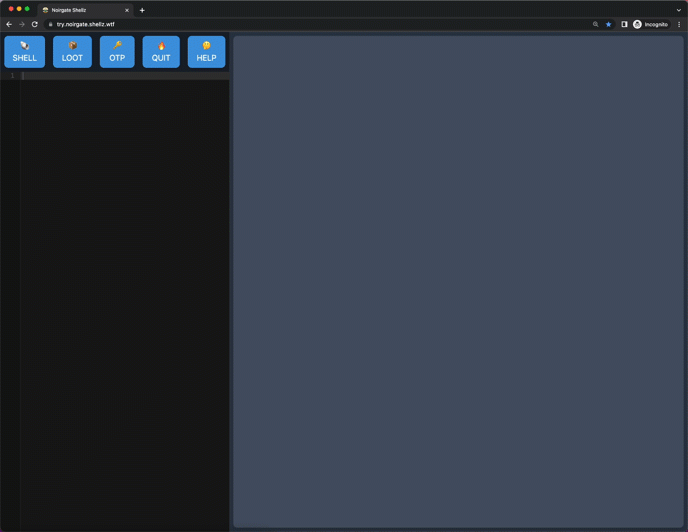

# Noirgate ꩜

NoirGate provides on-demand ephemeral anonymous shells secured by TOTP.
[Try Me!](https://try.noirgate.shellz.wtf) - <p>Text HOW to 1-337-561-1337</p>
<p align="center">

</p>

##
 There are often times while conducting security research where you need a quick disposable terminal environment to validate findings
or conduct research anonymously. Noirgate provides on-demand web sandboxes running Tor, and DNS over TLS for layer-7 anonymity.

## Features

* Multiple-API Endpoints (SMS, REST, ChatOps)
* Network controls
  * DNS over TLS
  * Torsocks + Privoxy
* Container controls
  * Low-Privilege Container user
  * Dangerous capabilities removed
  * Limits imposed via ulimit
* Host controls
  * Isolated client, and management networks
  * Restrictions on metadata interfaces

## Components

* Noirgate-Manager - Lifecycle management and control for noirgate-shell containers
* Noirgate-Procurement - Discord/Slack bot for Chatops integration
* Noirgate-DiscoDNS - Noirgate Shell DNS server
* Noirgate-Shell - Base Noirgate container containing the tools below

## Tools

* Cloud provider clients
* Offensive security tools
* Defense security tools
* Developer tools

## Prerequisites

1. AWS Account
2. IAM role to deploy the terraform code
3. Twilio API Key (optional)
4. Valid x509 Certificate (not self-signed)
5. Terraform
6. Docker-Compose
7. x86_64 host

## Getting Started

### Method #1 
1. Clone the repo locally 
`git clone https://github.com/Shell-Company/noirgate-public`
2. Build the Noirgate host
`cd noirgate-public/noirgate-terraform && terraform apply` 
> Wait for terraform build to complete and ssh into the noirgate-host using the provided PEM file
3. Set environment variables below on the host 
```
TWILIO_SID - Twilio account ID
TWILIO_TOKEN - Twilio Secret
TWILIO_NUMBER - Twilio Phone Number
AWS_ACCESS_KEY_ID - access key
AWS_SECRET_ACCESS_KEY - secret
NOIRGATE_BOT_TOKEN - Discord bot token
```

### Method #2 

1. Same as above
2. Follow step #3 from above
3. Run docker-compose-no-sms.yml 
`sudo -E docker-compose -f ./noirgate-compose/docker-compose-no-sms.yml up`

# To-Do
* Add instructions for deploying on Kubernetes
* Add server secret validation for discord bots and rest API

>This software is provided as is without any warranty of any kind, and is currently a work in progress.
